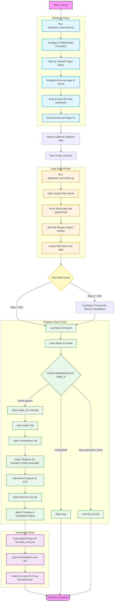

# Automation Workflow Diagram

Here is the complete sequence of actions that the automation scripts currently perform, mapped out as a flowchart.

```mermaid
graph TD
    %% Main Script Entry
    A[Start: main.py] --> B[Run playbison_automation.py]
    
    %% Playbison Extraction
    subgraph Playbison Phase
        B --> C[Navigate to 'Withdrawals To Confirm']
        C --> D[Filter by 'Verified' Player Status]
        D --> E[Navigate to the last page of results]
        E --> F[Scan for Non-VIP roles backwards]
        F --> G[Extract Email and Player ID]
    end
    
    %% Passing Data
    G --> H[main.py captures clipboard data]
    H --> I[Save to last_user.json]
    I --> J[Run datastudio_automation.py]

    %% Data Studio Phase
    subgraph Data Studio Phase
        J --> K[Open Google Data Studio]
        K --> L[Focus Email input and paste Email]
        L --> M[Set Date Range to past 2 months]
        M --> N[Extract W/D Ratio from table]
    end
    
    %% Ratio Decision Logic
    N --> O{W/D Ratio Check}
    O -- "Ratio < 25%" --> Q[Log Ratio & Proceed]
    O -- "Ratio >= 25%" --> R_alt[Log Ratio & Proceed for Manual Cancellation]
    R_alt --> Q
    
    %% Playbison Deep Check
    subgraph Playbison Deep Check
        Q --> R[Open Player ID modal]
        R --> S{Extract maskedAccount & wallet_id}
        S -- Check passed --> T[Open wallet_id in new tab]
        S -- Name Mismatch / Error --> U[Print Error & Exit]
        S -- COINSPAID --> V[Skip Copy]
        
        T --> W[Open Notes Tab]
        W --> X[Open Transactions Tab]
        X --> Y[Check 'Redeem the bonuses' & Note 'automatic']
        Y --> Z[Set Amount range in to -8.01]
        Z --> AA[Open Payment Log Tab]
        AA --> AB[Select 'Pending' & 'Completed' Status]
    end
    
    %% PaymentIQ
    subgraph PaymentIQ Phase
        AB --> AC[Load original Player ID from last_user.json]
        AC --> AD[Open PaymentIQ in new tab]
        AD --> AE[Search for user+ID in top-left Search bar]
    end
    
    AE --> AF([Workflow Complete])
    V --> AF
    U --> AF
    
    %% Styling
    classDef startEnd fill:#f9f,stroke:#333,stroke-width:2px;
    classDef phase1 fill:#e1f5fe,stroke:#03a9f4,stroke-width:2px;
    classDef phase2 fill:#fff3e0,stroke:#ff9800,stroke-width:2px;
    classDef phase3 fill:#e8f5e9,stroke:#4caf50,stroke-width:2px;
    classDef phase4 fill:#f3e5f5,stroke:#9c27b0,stroke-width:2px;
    classDef decision fill:#fff9c4,stroke:#fbc02d,stroke-width:2px;
    
    class A,AF startEnd;
    class B,C,D,E,F,G phase1;
    class J,K,L,M,N phase2;
    class Q,R,S,T,U,V,W,X,Y,Z,AA,AB phase3;
    class AC,AD,AE phase4;
    class O decision;
```
